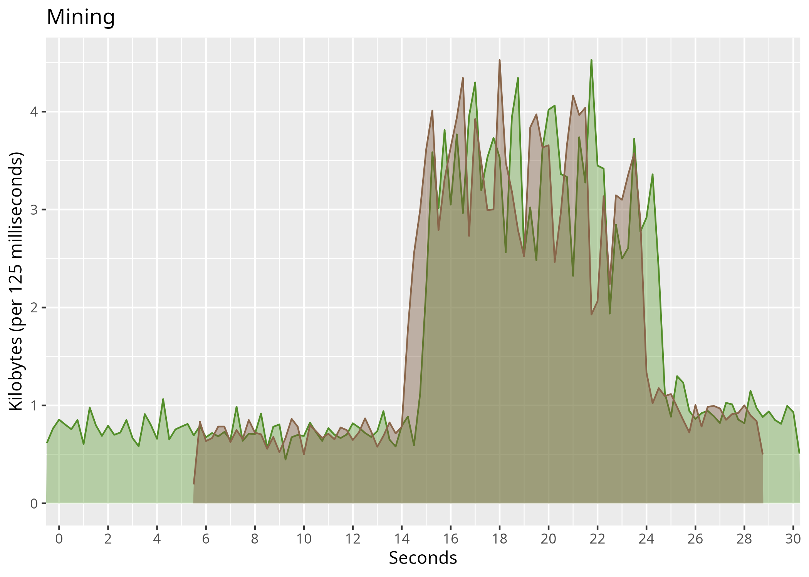

# Introduction
This is a short and simple script I made to process some Wireshark data for a report
on Minecraft's network usage, but I decided to share it in the hopes that others
(especially future students) don't have to walk through the mud that is R too.

The intent orginally was to process pairs of tests (in my case server and client) and stack them, but it can handle single tests as well as stacking infinite (?) graphs too.

Generates a png file for every test and a pdf file with all graphs.

COMMENT: the code is probably horrible, I haven't used R too much -- feel free to contribute!

## Features
- processes all graphs at once
- can stack graphs (more on that later)
- ease of access settings

# Usage
1. Use Wiresharks GUI or tshark to filter your capture to your liking. Use the built in Statistics -> IO graphs tool to preview it
	a. if using GUI, save file as .pcapng, choosing only the displayed (filtered packages)
2. For ease of conversion, move all pcapng files to the same folder
3. Run the shell script in that location (you may need to chmod+x the script first)
	Or individually run: `tshark -r <PATH TO PCAPNG> -o 'gui.column.format: "Absolute Time", %Yt, "Bytes", "%L"'> <PATH TO CSV>`
4. Then run the Rscript using: `Rscript <PATH TO THIS SCRIPT> *.csv` 
5. Enjoy
## Example
1. See the CSV file in /examples. Optionally remove the .png file already present
2. Run the R-script (no shell script, since I would need to include the pcapng file, which I can't due to privacy)
3. See the generated PNG file

## Requirements
- Files need to be in pcapng format (unless you want to edit the shell script)
- Any externally generated CSV-files (if not using provided command) need to have two columns, absolute time and bytes
- The name follows the pattern testtype_subtype[...].csv
	the [...] can be anything, the script uses "testtype" to identify the graphs to be stacked and subtype to sort them 

## How does it work?
The shell script first generates CSV files, with only two columns.
The R script processes all these files at once and categorizes them according to testtype and splits them accordingly.
	It then processes each subtype one by one for each test and adds it to each tests plot and then everything is saved.

More information is available in the comments of the R-script

# Known issues
- [ ] Windows support
- [ ] Interval likes to be 0.125, 0.250, 0.500, e.t.c. or the script doesn't behave correctly
- [ ] No user help (no error messages or error handling)
